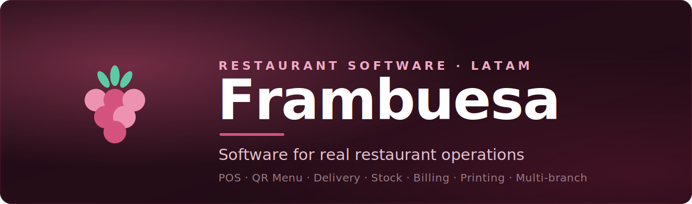
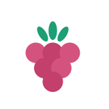

<!-- ===================== HERO ===================== -->

 
 

<a href="#frambuesa">Frambuesa</a>&nbsp;&nbsp;·&nbsp;&nbsp;<a href="#context">Context</a>&nbsp;&nbsp;·&nbsp;&nbsp;<a href="#projects">Projects</a>&nbsp;&nbsp;·&nbsp;&nbsp;<a href="#stack">Stack</a>&nbsp;&nbsp;·&nbsp;&nbsp;<a href="#contact">Contact</a>

 
 

# Tomás Firbeda

### Founder & operator building Frambuesa

<em>I run real food businesses in Argentina and build software for real restaurant operations.</em>

  
  
  

> **Why this is different:** I don't build restaurant software from a whiteboard. I run real operations and build from real friction — Frambuesa is shaped by live service, staff needs and daily business reality.

 

<!-- ===================== BUILDING FRAMBUESA ===================== -->

## 🍓 Building Frambuesa

**Frambuesa** is operational software for restaurants, cafés and food businesses across **LATAM** — built to run the counter, the kitchen, delivery and the back office from one place. It's the system I use to run my own stores. The goal is simple: **software that survives a Saturday night.**

<table width="100%">
  <tr valign="top">
    <td width="50%">

- 🧾 **POS & counter sales**
- 📲 **QR menu**
- 💬 **WhatsApp delivery workflow**
- 📦 **Multi-branch stock**

</td>
<td width="50%">

- 🖨️ **Printing connector**
- 🧮 **Billing · AFIP / ARCA**
- 📊 **Business analytics**
- 👥 **Team operations**

</td>
  </tr>
</table>

 

<!-- ===================== REAL-WORLD CONTEXT ===================== -->

## 🔥 Real-world context

<table width="100%">
  <tr align="center">
    <td><h2>4</h2></td>
    <td><h2>45+</h2></td>
    <td><h2>100%</h2></td>
    <td><h2>📱</h2></td>
  </tr>
  <tr align="center">
    <td><b>active food stores</b></td>
    <td><b>people in daily operation</b></td>
    <td><b>built from real operations</b></td>
    <td><b>mobile-first for LATAM</b></td>
  </tr>
</table>

Built from real restaurant operations · tested with real sales, shifts and staff · designed for real service pressure.

 

<!-- ===================== FEATURED PROJECTS ===================== -->

## 🧩 Featured Projects

<table width="100%">
  <tr valign="top">
    <td width="33%" align="center">
       
      <b><a href="https://www.frambuesa.app">Frambuesa</a></b> 
      Operational software for restaurants & cafés in LATAM — POS, QR menu, delivery, stock & billing.
    </td>
    <td width="33%" align="center">
      <b>MediaUpload</b> 
      Local-first media drop: drag & drop screenshots and clips, get an instant shareable URL for AI agents.
    </td>
    <td width="33%" align="center">
      <b><a href="https://consultoriafirbeda.vercel.app">Consultoría Firbeda</a></b> 
      Advisory site and automation (Telegram bot) for my consulting work with local businesses.
    </td>
  </tr>
</table>

 

<!-- ===================== STACK ===================== -->

## 🛠️ Stack

  
  
  
  
  
  
  
  
  
  

<b>🎯 Current focus</b>

 

- ⚡ Fast, reliable **POS & printing** under rush-hour load
- 🏬 Deeper **multi-branch stock** for growing businesses
- 🧮 Tighter **billing (AFIP / ARCA)** compliance
- 📈 Clear **owner analytics** at a glance

 

<!-- ===================== CONTACT ===================== -->

## 📬 Building Frambuesa for restaurant operations in LATAM

 
 

<b>Frambuesa</b> — software for real food businesses in LATAM.

